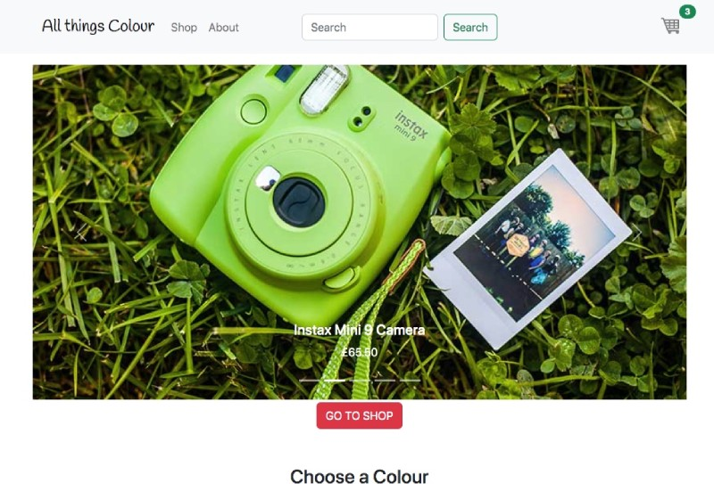
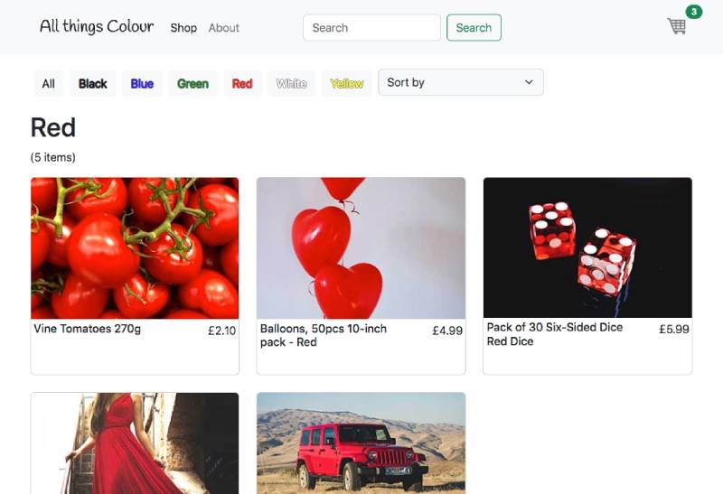
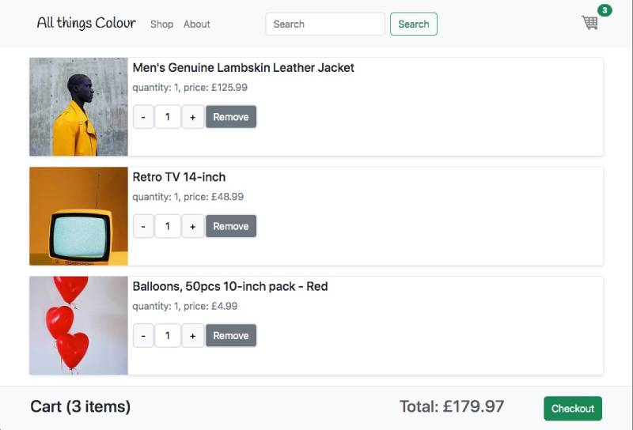

# Shopping Cart App

Created with React, React-router and Bootstrap.

Components and website tested with React testing library and Jest.

Features:

- Page handling using React-router.
- Product category filter.
- Sort products alphabetically and by price.
- Search products with the search-bar.
- Quantity and price calculation on cart page.
- Cart items are saved in local storage using custom useLocalStorage React hook.
- Global state management using useContext React hook.

To run the app in development mode:

```
npm start
```

To build the app for production:

```
npm run build
```

To run all tests

```
npm test
```






